Remember you should

* add code chunks by clicking the *Insert Chunk* button on the toolbar or by
pressing *Ctrl+Alt+I* to answer the questions!
* **knit** your file to produce a markdown version that you can see!
* save your work often 
  * **commit** it via git!
  * **push** updates to github

## Using ggplot2

ggplot2 is a great plotting package that allows a lot of control over your output.
Let's do some examples using the sleep dataset that we left off with last week. 
Load the dataset

```r
sleep <- read.csv("https://raw.githubusercontent.com/jsgosnell/CUNY-BioStats/master/datasets/sleep.csv", stringsAsFactors = T)
#need to use stringsAsFactors to make characters read in as factors
```

ggplot2 works in layers so you can or subtract as needed. Provided code is verbose here
so you can see what its doing.  First, install and call the package.


```r
library(ggplot2)
```

To make a plot, first set a base layer using the **ggplot** function.  


```r
dreaming_sleep_relationship <- ggplot(sleep, aes(x=TotalSleep, y = Dreaming))
```

Here we are naming a dataframe to use (first argument), then noting which columns
to use for the x and y axis (under the aes argument, stands for aesthetics).

Note when we do this we get a blank graph (if we name the ggplot output, we have 
to call it to see it!)


```r
dreaming_sleep_relationship
```

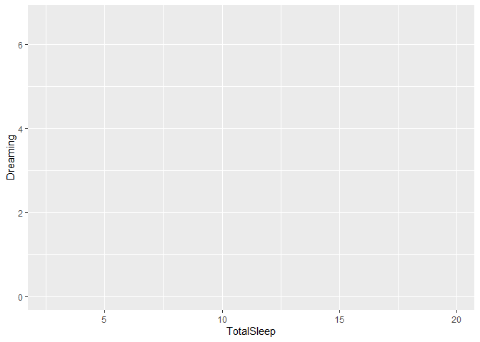<!-- -->

Next we add data layers using geom_ commands.  Let's start with a scatter plot,
which we make using the geom_point command.


```r
dreaming_sleep_relationship_scatter <- ggplot(sleep, aes(x=TotalSleep, y = Dreaming)) + 
  geom_point()
```

Again, nothing is shown, but not the object is saved! We can call it


```r
dreaming_sleep_relationship_scatter
```

```
## Warning: Removed 14 rows containing missing values (geom_point).
```

<!-- -->

We can also just call it directly, but when/if we do this the object is not 
saved in the environment.


```r
ggplot(sleep, aes(x=TotalSleep, y = Dreaming)) +
  geom_point()
```

```
## Warning: Removed 14 rows containing missing values (geom_point).
```

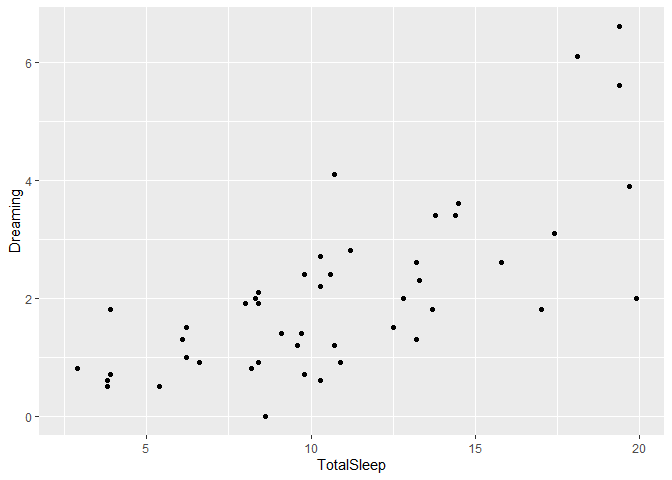<!-- -->

If nothing extra is given, the geom_commands inherit everything from the ggplot 
command. So here we get a scatter plot of the relationship between TotalSleep and 
Dreaming. Note the axis labels are the column titles, which may not be what we 
want in the end in regards to readability.

However, now you have a basic plot.  You can also use other arguments in geom_layer commands 
to add to it. For example, let's color 
these by primate


```r
ggplot(sleep, aes(x=TotalSleep, y = Dreaming)) +
  geom_point(aes(colour=Primate))
```

```
## Warning: Removed 14 rows containing missing values (geom_point).
```

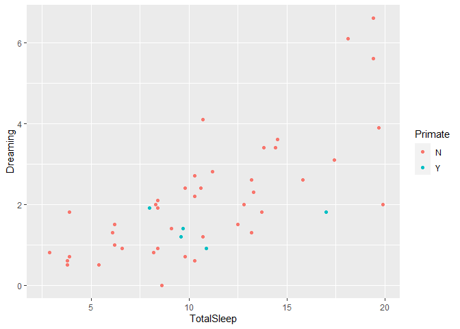<!-- -->

Now we've added information on primates. Since that require us to get more data 
from the dataset, we had to add another aes argument.  Note this is different from
(not evaluated in code, as it causes an error!)


```r
ggplot(sleep, aes(x=TotalSleep, y = Dreaming)) +
  geom_point(colour="Primate")
```
or


```r
ggplot(sleep, aes(x=TotalSleep, y = Dreaming)) +
  geom_point(colour="blue")
```

```
## Warning: Removed 14 rows containing missing values (geom_point).
```

<!-- -->

The first causes an error as primate isn't a color. The second makes all points blue!
Also note the 2nd method
loses the legend as color now conveys no information.

In general, you have to put things you want to plot in the aes argument area
and anything outside of that changes the entire plot. For example, we can change 
the size of all points using


```r
ggplot(sleep, aes(x=TotalSleep, y = Dreaming)) +
  geom_point(size = 4)
```

```
## Warning: Removed 14 rows containing missing values (geom_point).
```

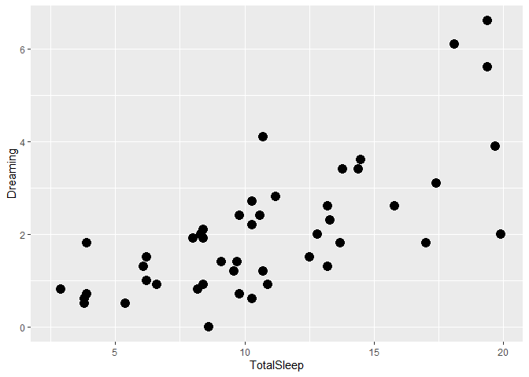<!-- -->

This is also a good time to talk about renaming factor labels. You may want to change 
Primate levels to Yes and No for your graph. Lots of ways to do this, but the 
**revalue** function 
in the plyr package is nice (and we'll use this suite of packages often, same person
developed ggplot2, plyr, and reshape)


```r
library(plyr)
sleep$Taxa <- revalue(sleep$Primate, c(Y = "Primate", N = "Non-primate"))
```

Notice what I did above. I made a new column from an existing one using a name 
I might want on a legend. Now I can use it in a graph.


```r
ggplot(sleep, aes(x=TotalSleep, y = Dreaming)) +
  geom_point(aes(colour=Taxa))
```

```
## Warning: Removed 14 rows containing missing values (geom_point).
```

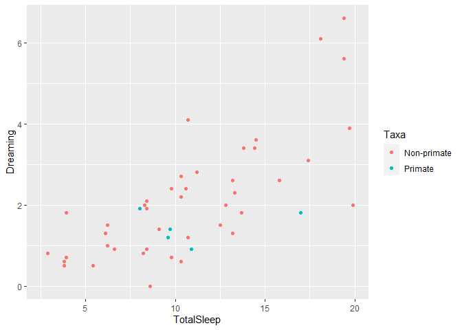<!-- -->

I can also just change the legend title directly or change legend text, but often 
workign with the dataframe is easier for me.

If we wanted the levels of Primate in a different order, we can use the 
**relevel** function in the plyr package to set one as the 
"first" level (and then do this sequentially to get them in the right order if 
needed).  You can also change level orders using the factor or ordered functions 
for multiple levels at once.


```r
sleep$Taxa <- relevel(sleep$Taxa, "Primate" )
ggplot(sleep, aes(x=TotalSleep, y = Dreaming)) +
  geom_point(aes(colour=Taxa))
```

```
## Warning: Removed 14 rows containing missing values (geom_point).
```

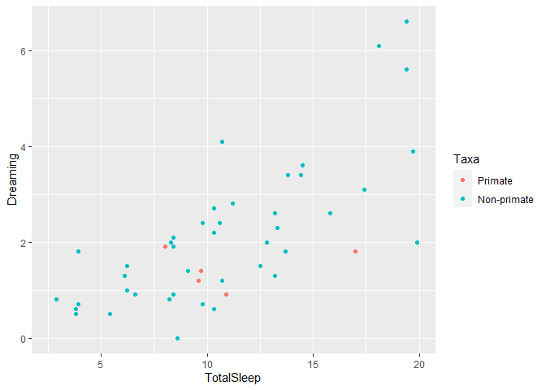<!-- -->

Finally, we can use the **theme** or related functions (like **xlab**, **ylab**,
**ggtitle**) to change how the graph looks. Note, all the code here is 
verbose so you can change as needed, but you rarely need all this. 


```r
ggplot(sleep, aes(x=TotalSleep, y = Dreaming)) +
  geom_point(aes(colour=Taxa), size = 4) +
  #below here is ylabel, xlabel, and main title
  ylab("Average hours spent dreaming daily") +
  xlab("Average hours spent sleeping daily") +
  ggtitle("Time spent dreaming increases with total sleeping time") +
  #theme sets sizes, text, etc
  theme(axis.title.x = element_text(face="bold", size=28), 
        axis.title.y = element_text(face="bold", size=28), 
        axis.text.y  = element_text(size=20),
        axis.text.x  = element_text(size=20), 
        legend.text =element_text(size=20),
        legend.title = element_text(size=20, face="bold"),
        plot.title = element_text(hjust = 0.5, face="bold", size=32),
        # change plot background, grid lines, etc (just examples so you can see)
        panel.background = element_rect(fill="white"),
        panel.grid.minor.y = element_line(size=3),
        panel.grid.major = element_line(colour = "black"),
        plot.background = element_rect(fill="gray"),
        legend.background = element_rect(fill="gray"))
```

```
## Warning: Removed 14 rows containing missing values (geom_point).
```

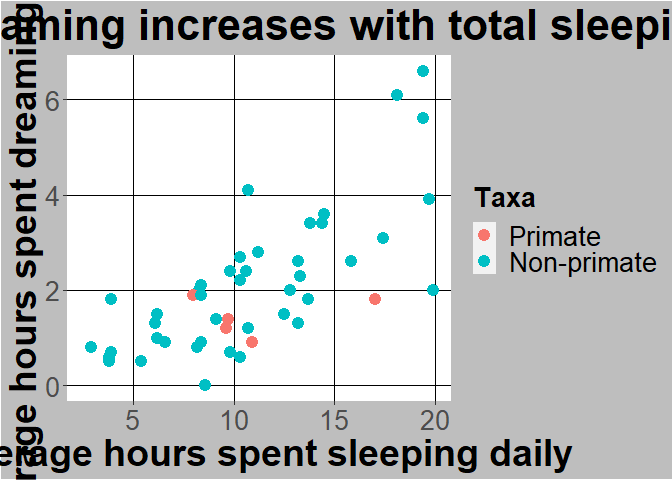<!-- -->

You can also directly change legend title and colours with the scale_ commands


```r
ggplot(sleep, aes(x=TotalSleep, y = Dreaming)) +
  geom_point(aes(colour=Taxa), size = 4) +
  #below here is ylabel, xlabel, and main title
  ylab("Average hours spent dreaming daily") +
  xlab("Average hours spent sleeping daily") +
  ggtitle("Time spent dreaming increases with total sleeping time") +
  #scale commands help with legends
  scale_colour_manual(name="Type of mammal",values = c("#FFA373","#50486D")) +
  #theme sets sizes, text, etc
  theme(axis.title.x = element_text(face="bold", size=28), 
        axis.title.y = element_text(face="bold", size=28), 
        axis.text.y  = element_text(size=20),
        axis.text.x  = element_text(size=20), 
        legend.text =element_text(size=20),
        legend.title = element_text(size=20, face="bold"),
        plot.title = element_text(hjust = 0.5, face="bold", size=32),
        # change plot background, grid lines, etc (just examples so you can see)
        panel.background = element_rect(fill="white"),
        panel.grid.minor.y = element_line(size=3),
        panel.grid.major = element_line(colour = "black"),
        plot.background = element_rect(fill="gray"),
        legend.background = element_rect(fill="gray"))
```

```
## Warning: Removed 14 rows containing missing values (geom_point).
```

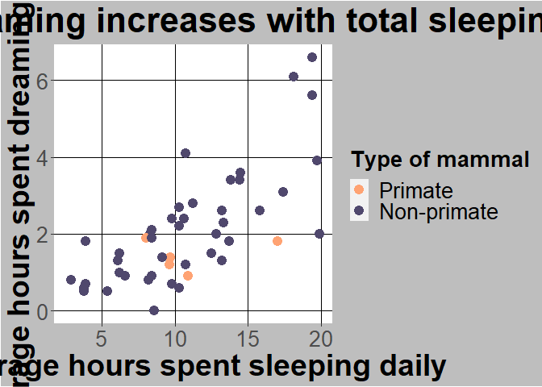<!-- -->

In general scale_[whatever you had aes commands]_manual lets you set colors or codes.
To see color codes go to 
[this chart](http://sape.inf.usi.ch/quick-reference/ggplot2/colour){target="_blank"}

You can also facet a graph by another column. For example, I can split the graph 
I already made by Taxa


```r
ggplot(sleep, aes(x=TotalSleep, y = Dreaming)) +
  geom_point(aes(colour=Taxa), size = 4) +
  #below here is ylabel, xlabel, and main title
  ylab("Average hours spent dreaming daily") +
  xlab("Average hours spent sleeping daily") +
  ggtitle("Time spent dreaming increases with total sleeping time") +
  #scale commands help with legends
  scale_colour_manual(name="Type of mammal",values = c("#FFA373","#50486D")) +
  #theme sets sizes, text, etc
  theme(axis.title.x = element_text(face="bold", size=28), 
        axis.title.y = element_text(face="bold", size=28), 
        axis.text.y  = element_text(size=20),
        axis.text.x  = element_text(size=20), 
        legend.text =element_text(size=20),
        legend.title = element_text(size=20, face="bold"),
        plot.title = element_text(hjust = 0.5, face="bold", size=32),
        # change plot background, grid lines, etc (just examples so you can see)
        panel.background = element_rect(fill="white"),
        panel.grid.minor.y = element_line(size=3),
        panel.grid.major = element_line(colour = "black"),
        plot.background = element_rect(fill="gray"),
        legend.background = element_rect(fill="gray")) +
  facet_wrap(~Taxa, ncol = 1)
```

```
## Warning: Removed 14 rows containing missing values (geom_point).
```

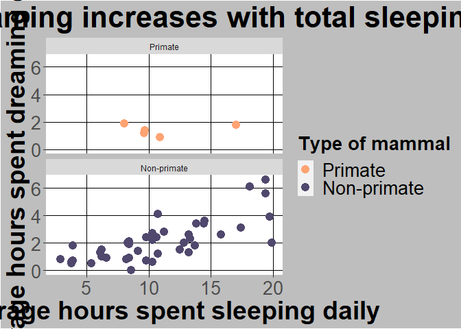<!-- -->

Notice doing this and having legend may be redundant, so I can remove the legend


```r
ggplot(sleep, aes(x=TotalSleep, y = Dreaming)) +
  geom_point(aes(colour=Taxa), size = 4) +
  #below here is ylabel, xlabel, and main title
  ylab("Average hours spent dreaming daily") +
  xlab("Average hours spent sleeping daily") +
  ggtitle("Time spent dreaming increases with total sleeping time") +
  #scale commands help with legends
  scale_colour_manual(name="Type of mammal",values = c("#FFA373","#50486D")) +
  #theme sets sizes, text, etc
  theme(axis.title.x = element_text(face="bold", size=28), 
        axis.title.y = element_text(face="bold", size=28), 
        axis.text.y  = element_text(size=20),
        axis.text.x  = element_text(size=20), 
        legend.text =element_text(size=20),
        legend.title = element_text(size=20, face="bold"),
        plot.title = element_text(hjust = 0.5, face="bold", size=32),
        # change plot background, grid lines, etc (just examples so you can see)
        panel.background = element_rect(fill="white"),
        panel.grid.minor.y = element_line(size=3),
        panel.grid.major = element_line(colour = "black"),
        plot.background = element_rect(fill="gray"),
        legend.background = element_rect(fill="gray"),
        strip.text.x = element_text(size = 18, colour = "purple")) +
  facet_wrap(~Taxa, ncol = 1) +
  guides(colour=FALSE)
```

```
## Warning: `guides(<scale> = FALSE)` is deprecated. Please use `guides(<scale> =
## "none")` instead.
```

```
## Warning: Removed 14 rows containing missing values (geom_point).
```

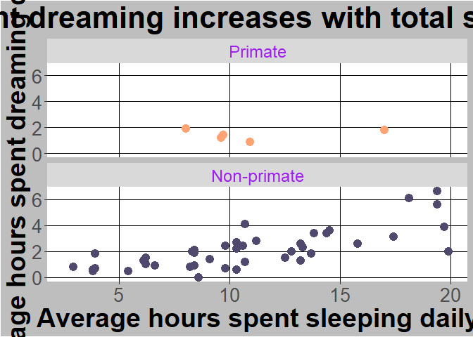<!-- -->


I also added a theme section to change the facet label.  All this shows how you 
are focused on adding or layering levels in ggplot2.

You can save the most recent plot directly to your working directory using


```r
ggsave("Fig1.jpg")
```

```
## Saving 7 x 5 in image
```

```
## Warning: Removed 14 rows containing missing values (geom_point).
```

This is useful when we need to send just an image to someone (or add it to a 
document).  You can also just save using rstudio functionality.

ggplot2 is a great example of needing to undertand basic functionality without 
having to remember everything.  The intro class lecture and accompanying code should
help you get started.  A few other points that often come up are noted below.

### Histograms

For histograms, you only need one axis (frequency is calculated automatically)


```r
ggplot(sleep, aes(x=Dreaming)) +
  geom_histogram()
```

```
## `stat_bin()` using `bins = 30`. Pick better value with `binwidth`.
```

```
## Warning: Removed 12 rows containing non-finite values (stat_bin).
```

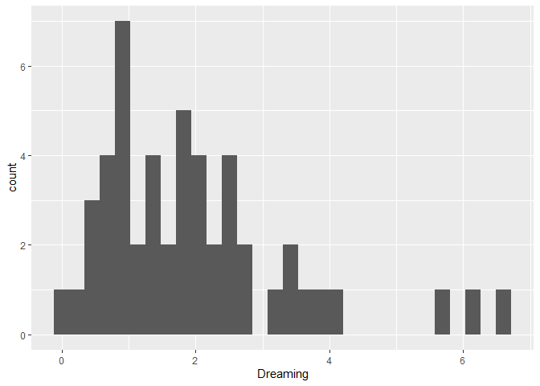<!-- -->

Note we can just copy our theme info from above and modify as needed (or ggplot2
will largely skip un-needed info).  You can also save and name a theme so you 
don't have to do all this everytime.


```r
ggplot(sleep, aes(x=Dreaming)) +
  geom_histogram() + 
  #below here is ylabel, xlabel, and main title
  ylab("Frequency") +
  xlab("Average hours spent dreaming daily") +
  ggtitle("Distribution of hours spent dreaming") +
  #theme sets sizes, text, etc
  theme(axis.title.x = element_text(face="bold", size=28), 
        axis.title.y = element_text(face="bold", size=28), 
        axis.text.y  = element_text(size=20),
        axis.text.x  = element_text(size=20), 
        legend.text =element_text(size=20),
        legend.title = element_text(size=20, face="bold"),
        plot.title = element_text(hjust = 0.5, face="bold", size=32),
        # change plot background, grid lines, etc (just examples so you can see)
        panel.background = element_rect(fill="white"),
        panel.grid.minor.y = element_line(size=3),
        panel.grid.major = element_line(colour = "black"),
        plot.background = element_rect(fill="gray"),
        legend.background = element_rect(fill="gray"),
        strip.text.x = element_text(size = 18, colour = "purple"))
```

```
## `stat_bin()` using `bins = 30`. Pick better value with `binwidth`.
```

```
## Warning: Removed 12 rows containing non-finite values (stat_bin).
```

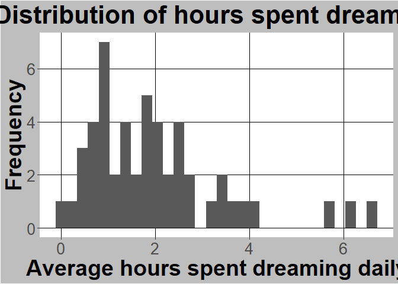<!-- -->

Finally, remember you can subset the dataframes you feed to the ggplot functions
(or any other function for that matter). For example, let's just do a histogram 
of just primate sleep.


```r
ggplot(sleep[sleep$Taxa == "Primate",], aes(x=Dreaming)) +
  geom_histogram() + 
  #below here is ylabel, xlabel, and main title
  ylab("Frequency") +
  xlab("Average hours spent dreaming daily") +
  ggtitle("Distribution of hours spent dreaming") +
  #theme sets sizes, text, etc
  theme(axis.title.x = element_text(face="bold", size=28), 
        axis.title.y = element_text(face="bold", size=28), 
        axis.text.y  = element_text(size=20),
        axis.text.x  = element_text(size=20), 
        legend.text =element_text(size=20),
        legend.title = element_text(size=20, face="bold"),
        plot.title = element_text(hjust = 0.5, face="bold", size=32),
        # change plot background, grid lines, etc (just examples so you can see)
        panel.background = element_rect(fill="white"),
        panel.grid.minor.y = element_line(size=3),
        panel.grid.major = element_line(colour = "black"),
        plot.background = element_rect(fill="gray"),
        legend.background = element_rect(fill="gray"),
        strip.text.x = element_text(size = 18, colour = "purple"))
```

```
## `stat_bin()` using `bins = 30`. Pick better value with `binwidth`.
```

```
## Warning: Removed 2 rows containing non-finite values (stat_bin).
```

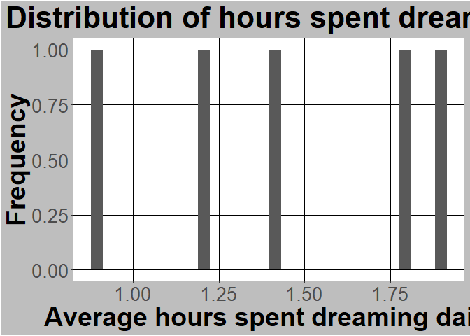<!-- -->

Not interesting, but you get the idea.  

### Barcharts and confidence intervals

Estimating is a key part of statistics and should include the value you are 
estimating and an estimate of uncertainty. Graphs typically show this using confidence
intervals, which rely on samples of means following a normal distribution that 
we can describe. If we assume the estimate 
(not the data!) is normally distributed, we can assume things about uncertainty.
Namely, we can build a 95% confidence interval around our estimate (meaning the true mean
is in the range 95 out of 100 times we create a sample).  ]For a review/primer of these ideas, use the following tutorials:

* https://www.zoology.ubc.ca/~whitlock/Kingfisher/SamplingNormal.htm
* https://www.zoology.ubc.ca/~whitlock/Kingfisher/CIMean.htm
* https://www.zoology.ubc.ca/~whitlock/Kingfisher/CLT.htm

Now's let do these in R.  Confidence intervals are often tied to barcharts. Although
these are common in practice, they are not
easy by default in R as statisticians don't love them. That's because they use a 
lot of wasted color. I'll show this in a moments. However, since they are common 
I'll show you how to build them. 

Let's go back to the sleep dataset and consider the average total sleep time speed 
for each exposure level.  First, lets change exposure to factors and label them


```r
str(sleep) #just a reminder
```

```
## 'data.frame':	62 obs. of  13 variables:
##  $ Species    : Factor w/ 62 levels "Africanelephant",..: 1 2 3 4 5 6 7 8 9 10 ...
##  $ BodyWt     : num  6654 1 3.38 0.92 2547 ...
##  $ BrainWt    : num  5712 6.6 44.5 5.7 4603 ...
##  $ NonDreaming: num  NA 6.3 NA NA 2.1 9.1 15.8 5.2 10.9 8.3 ...
##  $ Dreaming   : num  NA 2 NA NA 1.8 0.7 3.9 1 3.6 1.4 ...
##  $ TotalSleep : num  3.3 8.3 12.5 16.5 3.9 9.8 19.7 6.2 14.5 9.7 ...
##  $ LifeSpan   : num  38.6 4.5 14 NA 69 27 19 30.4 28 50 ...
##  $ Gestation  : num  645 42 60 25 624 180 35 392 63 230 ...
##  $ Predation  : int  3 3 1 5 3 4 1 4 1 1 ...
##  $ Exposure   : int  5 1 1 2 5 4 1 5 2 1 ...
##  $ Danger     : int  3 3 1 3 4 4 1 4 1 1 ...
##  $ Primate    : Factor w/ 2 levels "N","Y": 1 1 1 1 1 1 1 1 1 2 ...
##  $ Taxa       : Factor w/ 2 levels "Primate","Non-primate": 2 2 2 2 2 2 2 2 2 1 ...
```

```r
sleep$Exposure <- factor(sleep$Exposure)
```

Check levels


```r
levels(sleep$Exposure)
```

```
## [1] "1" "2" "3" "4" "5"
```

and relabel if you want (just for example here)


```r
levels(sleep$Exposure)<- c("Least","Less", "Average", "More", "Most") 
```

Next, we need to get the average and standard deviation for each group (remember 
this is tied to the normal distribution!).  If we wanted to this by hand, we could
do something like thi (let's just focus on least for an example, and note we have 
to remove NA data)


```r
mean(sleep[sleep$Exposure == "Least", "TotalSleep"], na.rm = T)
```

```
## [1] 12.94615
```

This is our estimate.  The standard deviation of this estimate is


```r
sd(sleep[sleep$Exposure == "Least", "TotalSleep"], na.rm = T) / 
  sqrt(length(sleep[sleep$Exposure == "Least" & is.na(sleep$TotalSleep) == F, "TotalSleep"]))
```

```
## [1] 0.7833111
```

which is equivalent to


```r
sd(sleep[sleep$Exposure == "Least", "TotalSleep"], na.rm = T) / 
  sqrt(length(na.omit(sleep[sleep$Exposure == "Least", "TotalSleep"])))
```

```
## [1] 0.7833111
```

We also call this the standard error of the mean. 

Fortunately, we can also do this using a function from the Rmisc package in R, 
as ggplot2 doesn't have it built in (maybe because bar charts are a bad idea?).


```r
library(Rmisc)
```

```
## Loading required package: lattice
```

```r
sleep_by_exposure <- summarySE(sleep, measurevar = "TotalSleep", groupvars = "Exposure", na.rm = T)
```

Inspect the table


```r
sleep_by_exposure
```

```
##   Exposure  N TotalSleep       sd        se       ci
## 1    Least 26   12.94615 3.994119 0.7833111 1.613259
## 2     Less 13   11.11538 3.957029 1.0974823 2.391209
## 3  Average  4    8.57500 1.808084 0.9040419 2.877065
## 4     More  5   10.72000 1.663430 0.7439086 2.065421
## 5     Most 10    4.19000 1.776670 0.5618323 1.270953
```

Now we can use this summarized data to make a graph that shows uncertainty (95%
confidence intervals)


```r
ggplot(sleep_by_exposure
       , aes(x=Exposure, y=TotalSleep)) +
  geom_col(size = 3) +
  geom_errorbar(aes(ymin=TotalSleep-ci, ymax=TotalSleep+ci), size=1.5) +
  ylab("Total sleep (hours per day")+ggtitle("Sleep across different taxa")+
  theme(axis.title.x = element_text(face="bold", size=28), 
        axis.title.y = element_text(face="bold", size=28), 
        axis.text.y  = element_text(size=20),
        axis.text.x  = element_text(size=20), 
        legend.text =element_text(size=20),
        legend.title = element_text(size=20, face="bold"),
        plot.title = element_text(hjust = 0.5, face="bold", size=32))
```

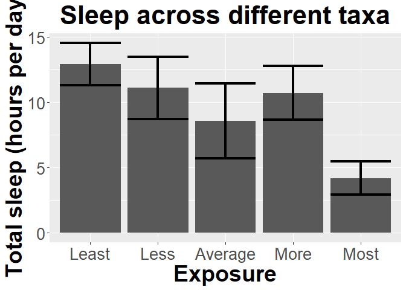<!-- -->

Now to show why barplots waste ink.  Note we can show the same information with


```r
ggplot(sleep_by_exposure
       , aes(x=Exposure, y=TotalSleep)) +
  geom_point(size = 3) +
  geom_errorbar(aes(ymin=TotalSleep-ci, ymax=TotalSleep+ci), size=1.5) +
  ylab("Total sleep (hours per day")+ggtitle("Sleep across different taxa")+
  theme(axis.title.x = element_text(face="bold", size=28), 
        axis.title.y = element_text(face="bold", size=28), 
        axis.text.y  = element_text(size=20),
        axis.text.x  = element_text(size=20), 
        legend.text =element_text(size=20),
        legend.title = element_text(size=20, face="bold"),
        plot.title = element_text(hjust = 0.5, face="bold", size=32))
```

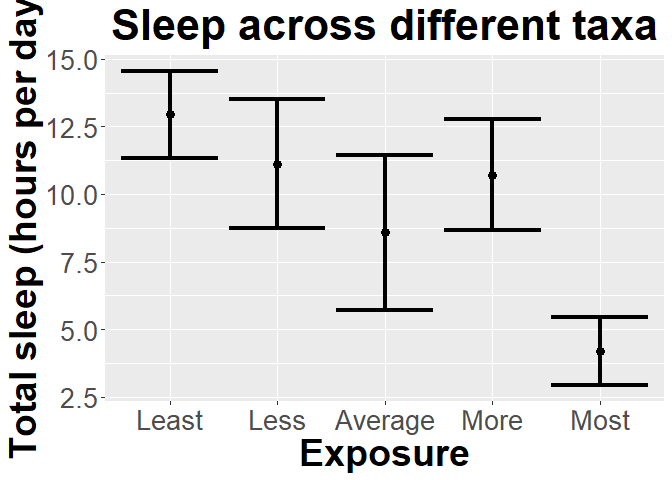<!-- -->

All the exta color is nice, but its not really adding anything!  

## Let's practice!

Last time you used the built-in plot functions to do some plots. Let’s replace 
those with ggplot2 and do some practice.

1. First plot how TotalSleep is explained by BrainWt (remember the issues with 
the data).  Use ggplot2 to plot the relationship.


```r
library(ggplot2)
ggplot(sleep[sleep$BrainWt <1000, ], aes(x=BrainWt, y = TotalSleep)) +
  geom_point(size = 4) +
  #below here is ylabel, xlabel, and main title
  ylab("Average hours spent \n sleeping daily") +
  xlab("Brain weight (g)") +
  ggtitle("Time spent sleeping \n decreases with brain \n weight") +
  #theme sets sizes, text, etc
  theme(axis.title.x = element_text(face="bold", size=28), 
        axis.title.y = element_text(face="bold", size=28), 
        axis.text.y  = element_text(size=20),
        axis.text.x  = element_text(size=20), 
        legend.text =element_text(size=20),
        legend.title = element_text(size=20, face="bold"),
        plot.title = element_text(hjust = 0.5, face="bold", size=32),
        # change plot background, grid lines, etc (just examples so you can see)
        panel.background = element_rect(fill="white"),
        panel.grid.minor.y = element_line(size=3),
        panel.grid.major = element_line(colour = "black"),
        plot.background = element_rect(fill="gray"),
        legend.background = element_rect(fill="gray"))
```

```
## Warning: Removed 4 rows containing missing values (geom_point).
```

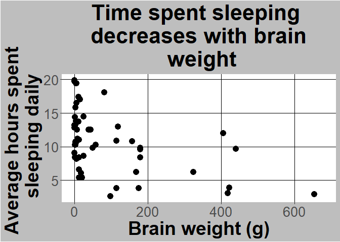<!-- -->

2. Next color code each plot point by whether or not its a primate.  In order 
to do this you can use the Primate column or (following class code) make a new 
column called Taxa to represent the information (hint:search for “ revalue”). 
Make sure axes are well-labeled.


```r
library(plyr)
sleep$Taxa <- revalue(sleep$Primate, c(Y = "Primate", N = "Non-primate"))
sleep$Taxa <- relevel(sleep$Taxa, "Primate")

ggplot(sleep[sleep$BrainWt <1000, ], aes(x=BrainWt, y = TotalSleep)) +
  geom_point(aes(colour=Taxa), size = 4) +
  #below here is ylabel, xlabel, and main title
  ylab("Average hours spent \n sleeping daily") +
  xlab("Brain weight (g)") +
  ggtitle("Time spent sleeping \n decreases with brain \n weight") +
  #scale commands help with legends
  scale_colour_manual(name="Type of mammal",values = c("#FFA373","#50486D")) +
  #theme sets sizes, text, etc
  theme(axis.title.x = element_text(face="bold", size=28), 
        axis.title.y = element_text(face="bold", size=28), 
        axis.text.y  = element_text(size=20),
        axis.text.x  = element_text(size=20), 
        legend.text =element_text(size=20),
        legend.title = element_text(size=20, face="bold"),
        plot.title = element_text(hjust = 0.5, face="bold", size=32),
        # change plot background, grid lines, etc (just examples so you can see)
        panel.background = element_rect(fill="white"),
        panel.grid.minor.y = element_line(size=3),
        panel.grid.major = element_line(colour = "black"),
        plot.background = element_rect(fill="gray"),
        legend.background = element_rect(fill="gray"))
```

```
## Warning: Removed 4 rows containing missing values (geom_point).
```

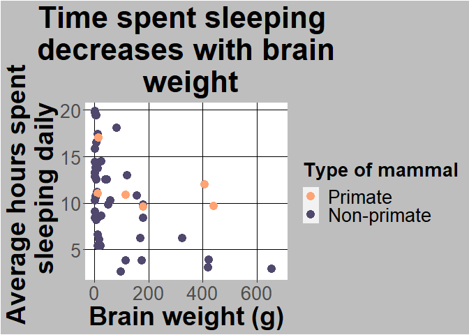<!-- -->


3. Let’s work with histograms.
* What type of variation do we see in total time spent sleeping? Create a 
histogram to explore this issue.


```r
ggplot(sleep
       , aes(x=TotalSleep)) +
  geom_histogram() +
  xlab("Total sleep (hours per day")+ggtitle("Variation in sleep levels")+
  theme(axis.title.x = element_text(face="bold", size=28), 
        axis.title.y = element_text(face="bold", size=28), 
        axis.text.y  = element_text(size=20),
        axis.text.x  = element_text(size=20), 
        legend.text =element_text(size=20),
        legend.title = element_text(size=20, face="bold"),
        plot.title = element_text(hjust = 0.5, face="bold", size=32))
```

```
## `stat_bin()` using `bins = 30`. Pick better value with `binwidth`.
```

```
## Warning: Removed 4 rows containing non-finite values (stat_bin).
```

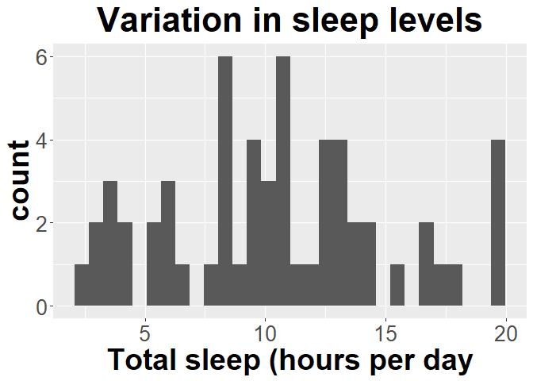<!-- -->
* Facet the graph you created based on whether or not the animal is a primate 
(Primate column).


```r
ggplot(sleep
       , aes(x=TotalSleep)) +
  geom_histogram() +
  xlab("Total sleep (hours per day")+ggtitle("Variation in sleep levels")+
  theme(axis.title.x = element_text(face="bold", size=28), 
        axis.title.y = element_text(face="bold", size=28), 
        axis.text.y  = element_text(size=20),
        axis.text.x  = element_text(size=20), 
        legend.text =element_text(size=20),
        legend.title = element_text(size=20, face="bold"),
        plot.title = element_text(hjust = 0.5, face="bold", size=32))+ 
  facet_wrap(~Taxa)
```

```
## `stat_bin()` using `bins = 30`. Pick better value with `binwidth`.
```

```
## Warning: Removed 4 rows containing non-finite values (stat_bin).
```

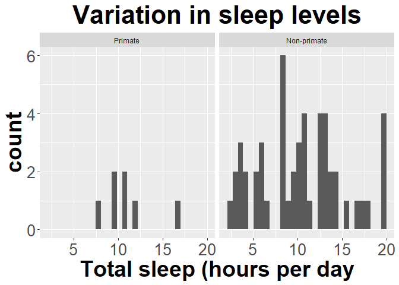<!-- -->

* Now only graph the data for primates.


```r
ggplot(sleep[sleep$Taxa == "Primate",]
       , aes(x=TotalSleep)) +
  geom_histogram() +
  xlab("Total sleep (hours per day")+ggtitle("Variation in sleep levels")+
  theme(axis.title.x = element_text(face="bold", size=28), 
        axis.title.y = element_text(face="bold", size=28), 
        axis.text.y  = element_text(size=20),
        axis.text.x  = element_text(size=20), 
        legend.text =element_text(size=20),
        legend.title = element_text(size=20, face="bold"),
        plot.title = element_text(hjust = 0.5, face="bold", size=32))
```

```
## `stat_bin()` using `bins = 30`. Pick better value with `binwidth`.
```

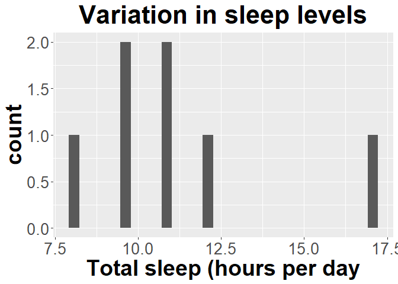<!-- -->

4. Develop a properly-labeled bar graph with error bars to explore how total 
sleep changes with 
* Primate (relabeled as yes/no as Primate/Non-Primate; note 
there are multiple ways to do this!) – use a 95% confidence interval for the bar


```r
#use summarySE function from Rmisc package
sleep$Primate <- revalue(sleep$Primate, c(Y = "Yes", N = "No"))
sleep$Primate <- relevel(sleep$Primate, "No")
library(Rmisc)
sleep_by_primate <- summarySE(sleep, measurevar = "TotalSleep", groupvars = "Primate", na.rm = T)
#look at it
sleep_by_primate
```

```
##   Primate  N TotalSleep       sd        se       ci
## 1      No 51   10.44510 4.810335 0.6735817 1.352929
## 2     Yes  7   11.17143 2.870955 1.0851189 2.655190
```

```r
library(ggplot2)
ggplot(sleep_by_primate
       , aes(x=Primate, y=TotalSleep)) +
  geom_col(size = 3) +
  geom_errorbar(aes(ymin=TotalSleep-ci, ymax=TotalSleep+ci), size=1.5) +
  ylab("Total sleep \n (hours per day")+ 
  xlab("Primate?")+ 
  ggtitle("Sleep across different taxa")+
  theme(axis.title.x = element_text(face="bold", size=28), 
        axis.title.y = element_text(face="bold", size=28), 
        axis.text.y  = element_text(size=20),
        axis.text.x  = element_text(size=20), 
        legend.text =element_text(size=20),
        legend.title = element_text(size=20, face="bold"),
        plot.title = element_text(hjust = 0.5, face="bold", size=32)) 
```

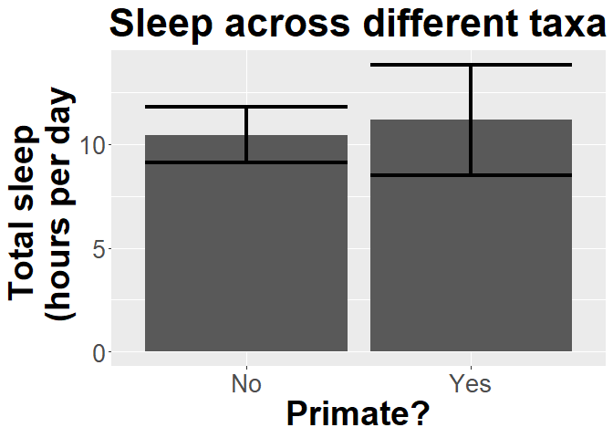<!-- -->

* Predation risk (as a factor!) – use 1 standard error for the bar. Note the difference!


```r
sleep$Predation <- as.factor(sleep$Predation)
sleep_by_predation <- summarySE(sleep, measurevar = "TotalSleep", 
                                groupvars = "Predation", na.rm = T)
#look at it
sleep_by_predation
```

```
##   Predation  N TotalSleep       sd       se       ci
## 1         1 14  12.050000 4.602299 1.230016 2.657288
## 2         2 15  12.720000 3.931957 1.015227 2.177445
## 3         3 10   9.120000 4.525680 1.431146 3.237476
## 4         4  7  10.228571 2.437700 0.921364 2.254496
## 5         5 12   7.383333 4.807727 1.387871 3.054684
```

```r
require(ggplot2)
ggplot(sleep_by_predation
       , aes(x=Predation, y=TotalSleep)) +
  geom_col(size = 3) +
  geom_errorbar(aes(ymin=TotalSleep-se, ymax=TotalSleep+se), size=1.5) +
  ylab("Total sleep \n (hours per day)") + 
  ggtitle("Sleep across different \n predation levels")+
  theme(axis.title.x = element_text(face="bold", size=28), 
        axis.title.y = element_text(face="bold", size=28), 
        axis.text.y  = element_text(size=20),
        axis.text.x  = element_text(size=20), 
        legend.text =element_text(size=20),
        legend.title = element_text(size=20, face="bold"),
        plot.title = element_text(hjust = 0.5, face="bold", size=32))
```

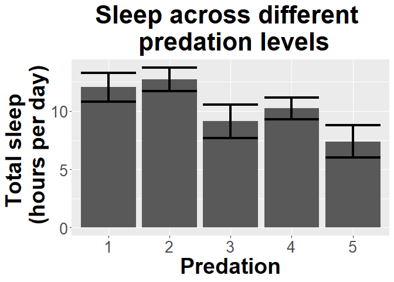<!-- -->
